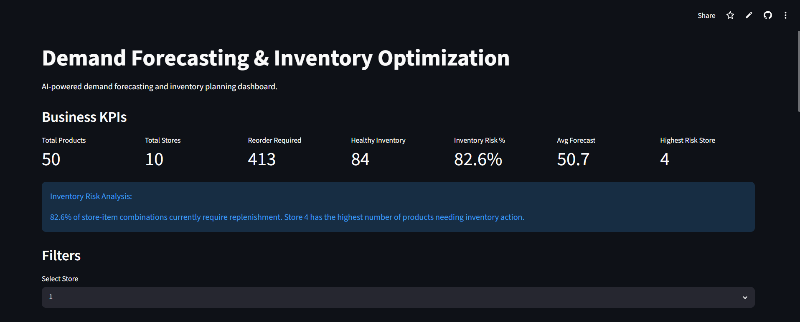
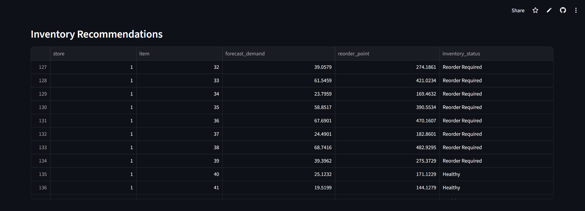
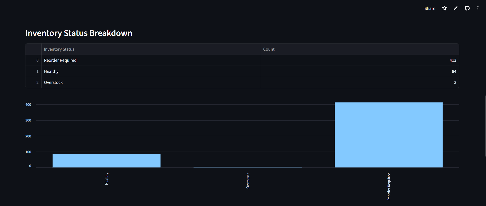
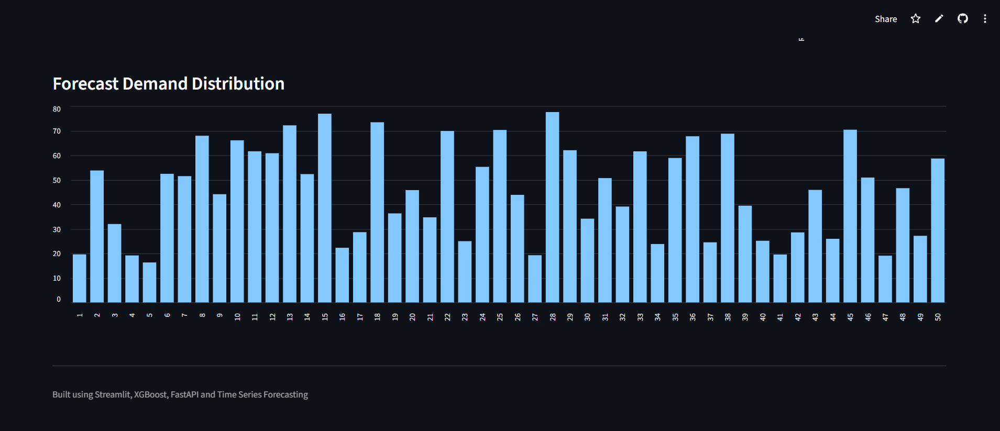

# 📦 Demand Forecasting & Inventory Optimization

An end-to-end Machine Learning system for retail demand forecasting and inventory optimization built using Time Series Forecasting, XGBoost, FastAPI, and Streamlit.

The system predicts future product demand across multiple stores and generates inventory recommendations to help businesses reduce stockouts, improve replenishment planning, and optimize inventory levels.

---

## 🚀 Live Demo

🔗 Streamlit Dashboard:

https://demand-forecasting-inventory-optimization-8ygrmmatj7v3kddgji2y.streamlit.app

---

## 📖 Project Overview

Retail businesses often face challenges such as:

- Stock shortages
- Overstocking
- Poor demand visibility
- Inefficient inventory planning
- Lost sales opportunities

This project addresses these challenges by:

1. Forecasting future product demand
2. Generating reorder recommendations
3. Identifying inventory risks
4. Providing an interactive business dashboard
5. Exposing forecasting services through FastAPI

---

## 🎯 Business Problem

Accurate demand forecasting is critical for supply chain and inventory management.

Without reliable forecasts, businesses may:

- Run out of stock during high demand periods
- Tie up capital in excess inventory
- Increase storage costs
- Lose customers due to poor product availability

This project helps inventory planners make data-driven decisions using machine learning.

---

## 🏗️ Project Architecture

```text
Raw Sales Data
       │
       ▼
Exploratory Data Analysis
       │
       ▼
Feature Engineering
       │
       ▼
XGBoost Forecasting Model
       │
       ▼
Demand Predictions
       │
       ▼
Inventory Optimization Engine
       │
       ▼
FastAPI Service
       │
       ▼
Streamlit Dashboard
       │
       ▼
Cloud Deployment
```

---

## 📊 Dataset Information

### Source

Kaggle Store Item Demand Forecasting Dataset

### Dataset Characteristics

- 913,000+ sales records
- 10 stores
- 50 products
- Daily sales observations
- Multi-store time series forecasting problem

---

## 🔍 Exploratory Data Analysis

Performed comprehensive EDA including:

- Missing value analysis
- Duplicate detection
- Store-wise demand analysis
- Product-wise sales analysis
- Time series trend visualization
- Seasonal pattern identification
- Demand distribution analysis

Generated detailed EDA reports and visualizations.

---

## ⚙️ Feature Engineering

Created advanced time-series features including:

### Calendar Features

- Year
- Month
- Quarter
- Day
- Day of Week
- Day of Year
- Week of Year
- Weekend Indicator

### Lag Features

- Lag 7
- Lag 14
- Lag 30
- Lag 90

### Rolling Statistics

- Rolling Mean (7 Days)
- Rolling Mean (30 Days)
- Rolling Std (7 Days)
- Rolling Std (30 Days)

These features significantly improved forecasting performance.

---

## 🤖 Machine Learning Model

### Model Used

XGBoost Regressor

### Why XGBoost?

- Handles non-linear patterns effectively
- Strong performance on tabular datasets
- Robust to feature interactions
- Fast training and inference

---

## 📈 Model Performance

### Baseline Model

| Metric | Score |
|----------|----------|
| MAE | 8.84 |
| RMSE | 11.59 |

### XGBoost Model

| Metric | Score |
|----------|----------|
| MAE | 6.09 |
| RMSE | 7.91 |

### Improvement

**31.79% RMSE improvement over baseline**

---

## 📦 Inventory Optimization Engine

The forecasting output is used to generate inventory recommendations.

### Inventory Logic

#### Reorder Required

Generated when:

```text
Forecast Demand > Current Inventory
```

#### Healthy Inventory

Generated when:

```text
Inventory sufficient for forecasted demand
```

#### Overstock

Generated when:

```text
Inventory significantly exceeds expected demand
```

### Results

| Inventory Status | Count |
|------------------|--------|
| Reorder Required | 413 |
| Healthy | 84 |
| Overstock | 3 |

---

## 🌐 FastAPI Endpoints

### Home Endpoint

```http
GET /
```

Response:

```json
{
  "message": "Demand Forecasting & Inventory Optimization API"
}
```

---

### Health Check

```http
GET /health
```

Response:

```json
{
  "status": "healthy"
}
```

---

### Forecast Endpoint

```http
POST /forecast
```

Request:

```json
{
  "store": 2,
  "item": 15
}
```

Response:

```json
{
  "store": 2,
  "item": 15,
  "forecast_demand": 106.02,
  "reorder_point": 741.22,
  "inventory_status": "Reorder Required"
}
```

---

## 📊 Streamlit Dashboard Features

### Business KPIs

- Total Products
- Total Stores
- Reorder Required Count
- Healthy Inventory Count
- Inventory Risk %
- Average Forecast
- Highest Risk Store

### Inventory Analytics

- Inventory Recommendation Table
- Inventory Status Distribution
- Forecast Demand Visualization
- Store-Level Filtering
- Inventory Risk Insights

---

## 📸 Dashboard Screenshots

### Dashboard Overview



---

### Inventory Recommendations



---

### Inventory Status Analysis



---

### Forecast Demand Distribution



---

## 🛠️ Tech Stack

### Programming

- Python

### Data Analysis

- Pandas
- NumPy

### Visualization

- Matplotlib
- Streamlit

### Machine Learning

- Scikit-Learn
- XGBoost

### API Development

- FastAPI
- Uvicorn

### Version Control

- Git
- GitHub

### Deployment

- Streamlit Community Cloud

---

## 📂 Project Structure

```text
Demand-Forecasting-Inventory-Optimization/
│
├── api/
│   ├── main.py
│   └── schemas.py
│
├── assets/
│   ├── dashboard_overview.png
│   ├── inventory_table.png
│   ├── forecast_chart_1.png
│   └── forecast_chart_2.png
│
├── data/
│
├── models/
│
├── notebooks/
│   ├── 01_data_quality_assessment.ipynb
│   ├── 02_exploratory_data_analysis.ipynb
│   ├── 03_feature_engineering.ipynb
│   ├── 04_model_training.ipynb
│   └── 05_inventory_optimization.ipynb
│
├── reports/
│
├── streamlit_app/
│   ├── app.py
│   └── inventory_recommendations.csv
│
├── requirements.txt
└── README.md
```

---

## 🎯 Key Achievements

✅ Processed 913K+ sales records

✅ Built advanced time-series forecasting pipeline

✅ Engineered lag and rolling-window features

✅ Improved forecasting accuracy by 31.79%

✅ Developed inventory optimization engine

✅ Built REST APIs using FastAPI

✅ Created interactive Streamlit dashboard

✅ Successfully deployed cloud-hosted application

---

## 👨‍💻 Author

### Nakul Rathore

Aspiring Data Scientist | Machine Learning Engineer

GitHub:

https://github.com/nakul2010

---

## ⭐ If you found this project useful

Please consider giving the repository a star.